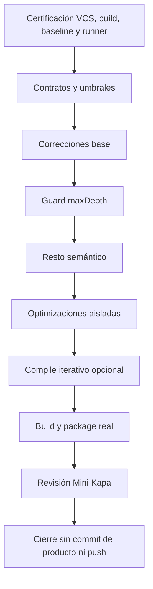

# Plan de implementación de reconstrucción desde `schema-shield@1.0.5`

> **Para agentes ejecutores:** usa `executing-plans`, `negative-first-tdd`, `engineering-discipline`, `lazy-driven-development` y `verification-before-completion`. Un solo Mini Kapa ejecutor completa las fases en el orden indicado. Al final, otro Mini Kapa realiza una revisión integral de solo lectura. No se permite ejecución paralela.

**Objetivo:** reconstruir SchemaShield desde el contenido publicado de `schema-shield@1.0.5`, conservar la arquitectura de validadores compuestos y descensos locales, corregir contratos comprobados, añadir protección selectiva de profundidad y aceptar optimizaciones solo cuando mantengan la semántica y superen los gates de throughput.

**Arquitectura:** cada schema se compila a un validador compuesto que recorre su arreglo local y plano de validators de keywords. Las keywords conservan la semántica y llaman a validators compilados de subschemas. El fast path builtin, acíclico y bajo el límite no crea contexto, wrapper ni branch de guardia por request. Los schemas que requieren protección usan el mecanismo mínimo de descenso guardado.

**Stack y build real:** Node.js 18 o posterior, Bun, TypeScript, Mocha, `expect`, JSON Schema Test Suite draft-06 y draft-07, AJV 6 y `@exodus/schemasafe` rc.3 según los locks certificados. El `source.js` y el package actuales usan Bun. Desde F0, `bun source.js` es el bundler autorizado para generar CJS, ESM, browser, sourcemaps y declarations. Node ejecuta los gates. Una posible migración del tooling de build se evalúa después en una fase aislada y no altera el build real de esta ejecución.

---

## 1. Alcance y decisiones vinculantes

### Objetivos

- Partir de los 50 archivos del tarball npm real `schema-shield@1.0.5` y demostrar igualdad 50 de 50 con `b3dbc7d` antes de editar producto.
- Versionar este plan en un commit exclusivo sobre `main` y respaldar todo el rediseño restante en un named stash verificable.
- Trabajar en la branch local `production-rebuild`, creada desde `b3dbc7d`.
- Mantener el plan commit, el named stash y la branch hasta la aceptación final.
- Conservar validadores compuestos, loop local plano y descensos desde keywords.
- Mantener el fast path para schemas builtin, acíclicos y con profundidad estática dentro del límite.
- Tratar toda keyword que no sea idéntica a la builtin registrada como potencial descenso personalizado.
- Definir `maxDepth` con raíz 0, valor predeterminado 128, hard cap 256 y error controlado `MAX_DEPTH_EXCEEDED`.
- Ejecutar preanálisis iterativo antes de cualquier `deepClone`, normalización o compilación recursiva.
- Aislar cada corrección y optimización con checkpoint, pruebas negativas y A/B contra producción y el checkpoint anterior.

### No objetivos y prohibiciones

- No construir un intérprete global, opcodes, frames, workspaces, continuations ni una segunda semántica.
- No usar `eval`, `Function`, code generation ni refs externas.
- No reemplazar la semántica local de las keywords por lógica duplicada en `SchemaShield`.
- No añadir contexto, wrapper ni branch por request al fast path ordinario.
- No afirmar que el producto tiene cero dependencias runtime sin comprobar el paquete real.
- No hacer push.
- No crear commits de producto, de candidato ni finales. El único commit autorizado es el commit exclusivo de este plan en F0.
- No descartar, limpiar ni restaurar destructivamente el rediseño antes de verificar el commit del plan y el named stash.
- No ejecutar fases, agentes ni suites en paralelo.

## 2. Evidencia repo-first de partida

### Estado VCS entregado

- `HEAD` y `main` apuntan a `41d762324eeaa7162952bb32b5aa893819169033`.
- El worktree contiene un rediseño tracked y untracked sin commit.
- Este plan está untracked antes de F0.
- El tag `1.0.5` apunta a `b3dbc7dc8a58752a569ebf90d856a6fbe47bb2b4`.
- El `gitHead` registrado por npm es `ebb2db15a5bb7e4bfe8988d83e85da66f08506d8`, anterior al tag de release.

### Paquete publicado

- Tarball: `schema-shield-1.0.5.tgz`.
- Tamaño comprimido observado: 124,943 bytes.
- SHA-1 publicado y recalculado: `e7f43d70386de8627a1cf7eda6238b5028ee342a`.
- Integrity publicada y recalculada: `sha512-2jhWkorvDXnPhK3H0BgT3pYJj/AdjOsf5skqg5vPtMjgBYQWKj0tQC42KUMpuR5tM1WgjxkiyEFOrnY56f6tOA==`.
- Los 50 archivos del tarball deben coincidir byte por byte con los mismos paths en `b3dbc7d`.
- Siete archivos difieren respecto de `ebb2db1`: `dist/index.js`, `dist/index.min.js`, `dist/index.min.js.map`, `dist/index.mjs`, `dist/utils/main-utils.d.ts`, `dist/utils/main-utils.d.ts.map` y `package.json`.
- Fuente de verdad: tarball verificado y `b3dbc7d`. El `gitHead` queda como dato histórico.

### Build y pruebas

- Fuente principal: `lib/index.ts`.
- Keywords: `lib/keywords/*.ts`, registradas por `lib/keywords.ts`.
- Build real del estado actual: `bun source.js`, que genera CJS, ESM, browser, sourcemaps y declarations.
- Tests: Mocha con `ts-node/register` mediante `npm test`.
- Suite larga: `npm run test:scratchpad`.
- Gate interno existente: `performance/short-gate.cjs`, con 1,003 casos y umbrales históricos de tiempo 1.02 global y 1.05 por cohorte.
- No hay workflow de CI en `.github`.

### Sibling benchmark certificado y de solo lectura

- El checkout permitido `../json-schema-benchmark` es `json-schema-benchmark@1.0.3` modificado, no el tarball npm 1.0.2.
- Usa corpus draft-06, metodología top 3 y rutas `--prod` o local hacia bundles CJS.
- Su submodule de JSON Schema Test Suite apunta a `bcf1dc81`.
- Su lock fija AJV 6 y `@exodus/schemasafe` rc.3.
- El sibling es estrictamente READ-ONLY. No se limpia, no se modifica y no se atribuye su dirty state a esta ejecución.
- Está prohibido ejecutar `npm run test` dentro del sibling porque reescribe README y reportes.
- El runner reproducible vive en `schema-shield/performance`. Si requiere material del sibling, copia únicamente archivos con paths conocidos a `schema-shield/tmp` y opera sobre esas copias.
- La referencia npm 1.0.2 solo puede aparecer como antecedente histórico. No describe el checkout sibling ni su corpus.

## 3. Política vinculante de acceso y herramientas

- Root principal permitido: `/home/masquerade-circus/NodeJs/Creaken/schema-shield`.
- Único sibling permitido: `/home/masquerade-circus/NodeJs/Creaken/json-schema-benchmark`.
- No inspeccionar el padre global `/home/masquerade-circus/NodeJs/Creaken`, otros siblings, `$HOME` ni rutas externas.
- Guardar temporales, tarballs, extracciones, outputs, evidencia y checkpoints solo en `schema-shield/tmp` o `schema-shield/.tmp`.
- No usar `/tmp/opencode`, `/tmp`, `/var/tmp` ni temporales globales.
- Cada comando Bash usa como `workdir` exacto uno de los dos roots permitidos. No usar `cd ..`.
- Leer rutas conocidas con `read` antes de cualquier descubrimiento.
- Usar `glob` solo con `path` y patrón acotados dentro de los roots permitidos.
- Usar la herramienta nativa `grep` únicamente para búsquedas puntuales, con `path` e `include` acotados.
- No usar Bash `grep`, `rg`, `find`, `cat`, `head`, `tail`, `sed` ni `awk` para explorar o leer.
- Reservar Bash para comandos de proyecto, VCS y npm dentro de los roots permitidos.
- Rediseñar dentro del alcance cualquier operación que parezca necesitar acceso exterior. No solicitar ni usar acceso global.

## 4. Protocolo VCS reversible de F0

### 4.1 Precondiciones y commit exclusivo del plan

1. Verificar `HEAD = 41d762324eeaa7162952bb32b5aa893819169033`, branch `main`, existencia de `41d7623^{commit}` y `b3dbc7d^{commit}`.
2. Registrar en `tmp/evidence/F0-vcs/` el status, el diff tracked y el inventario de archivos untracked antes de modificar el índice.
3. Stagear únicamente `docs/implementation-plan-schema-shield-production-rebuild.md`.
4. Verificar con `git diff --cached --name-status` que el índice contiene exactamente ese path.
5. Crear un solo commit exclusivo del plan con mensaje `docs: save production rebuild plan`. Esta autorización corresponde únicamente a "guardar plan".
6. Guardar `PLAN_SHA=$(git rev-parse HEAD)` y verificar `git show --stat --oneline "$PLAN_SHA"` y `git show --name-status --format=fuller "$PLAN_SHA"`.
7. Detener F0 si el commit incluye otro path, si el SHA no se resuelve o si `git show` no confirma el contenido esperado.

Comandos de contrato:

```bash
git rev-parse HEAD
git branch --show-current
git cat-file -e 41d762324eeaa7162952bb32b5aa893819169033^{commit}
git cat-file -e b3dbc7dc8a58752a569ebf90d856a6fbe47bb2b4^{commit}
git add -- docs/implementation-plan-schema-shield-production-rebuild.md
git diff --cached --name-status
git commit -m "docs: save production rebuild plan" -- docs/implementation-plan-schema-shield-production-rebuild.md
PLAN_SHA=$(git rev-parse HEAD)
git show --stat --oneline "$PLAN_SHA"
git show --name-status --format=fuller "$PLAN_SHA"
```

### 4.2 Named stash del rediseño restante

1. Después de verificar el plan commit, crear un named stash con todo el rediseño tracked y untracked restante.
2. Usar el nombre exacto `production-rebuild-redesign-backup-2026-07-25`.
3. Verificar que `stash@{0}` tiene ese nombre y revisar su listado tracked y untracked.
4. Guardar el identificador resuelto del stash en `tmp/evidence/F0-vcs/redesign-stash-ref.txt`.
5. Conservar el stash sin `pop`, `apply`, `drop` ni limpieza hasta que el usuario acepte el resultado final.
6. Detener F0 si el stash no existe, no contiene el rediseño esperado o el worktree conserva cambios que debían quedar respaldados.

```bash
git stash push --include-untracked -m "production-rebuild-redesign-backup-2026-07-25"
git stash list
git rev-parse stash@{0}
git stash show --stat --include-untracked stash@{0}
git stash show --name-status --include-untracked stash@{0}
git status --short --branch
```

### 4.3 Branch local desde producción y restauración del plan

1. Crear y cambiar a la branch local nombrada `production-rebuild` desde `b3dbc7dc8a58752a569ebf90d856a6fbe47bb2b4`.
2. Verificar branch, HEAD y merge-base. Nunca trabajar en detached HEAD.
3. Restaurar el plan desde `PLAN_SHA` al working tree de `production-rebuild`.
4. Verificar el hash del archivo restaurado contra el blob del plan commit.
5. Detener F0 si la branch no apunta a `b3dbc7d`, si el plan no coincide o si el stash dejó de estar disponible.

```bash
git switch -c production-rebuild b3dbc7dc8a58752a569ebf90d856a6fbe47bb2b4
git branch --show-current
git rev-parse HEAD
git merge-base --is-ancestor b3dbc7dc8a58752a569ebf90d856a6fbe47bb2b4 HEAD
PLAN_SHA=$(git rev-parse main)
git restore --source="$PLAN_SHA" --worktree -- docs/implementation-plan-schema-shield-production-rebuild.md
git hash-object docs/implementation-plan-schema-shield-production-rebuild.md
git rev-parse "$PLAN_SHA:docs/implementation-plan-schema-shield-production-rebuild.md"
git stash list
git status --short --branch
```

No ejecutar `git restore`, `git clean` ni otra operación destructiva antes de completar y verificar 4.1 y 4.2. No hacer push. No crear más commits.

## 5. Baseline, bundles CJS y checkpoints

### 5.1 Baseline inmutable

- Descargar el tarball en `schema-shield/tmp/baselines/schema-shield-1.0.5.tgz`.
- Verificar SHA-1, SHA-512 integrity y tamaño antes de extraer.
- Extraer en `schema-shield/tmp/baselines/schema-shield-1.0.5/package/`.
- Crear un manifest de sus 50 paths con modo, tamaño y SHA-256.
- Crear el mismo manifest desde `b3dbc7d` y exigir igualdad exacta 50 de 50.
- Usar como baseline únicamente el CJS autocontenido extraído `dist/index.js`, con ruta absoluta.
- No usar `lib/index.ts` ni otro source TypeScript como baseline o gate.
- Registrar versiones reales de Node, npm, Bun, AJV, schemasafe, sistema operativo, CPU, flags y hashes de locks.
- Autorizar `bun source.js` desde F0 como único bundler del estado actual. Node carga y ejecuta los bundles CJS resultantes en los gates.

### 5.2 Bundles admitidos por los gates

Los gates ejecutan solo estos tres CJS autocontenidos, siempre mediante rutas absolutas:

1. Producción: `tmp/baselines/schema-shield-1.0.5/package/dist/index.js`.
2. Previous: `tmp/checkpoints/<PHASE_ID>/before/dist/index.js`.
3. Candidate: `tmp/candidates/<PHASE_ID>/dist/index.js`.

Cada bundle debe tener SHA-256, no puede resolver imports contra source o contra otro candidato y se carga en procesos limpios con cache aislado. TypeScript se usa solo como diagnóstico de source y declarations. Una ejecución de `lib/index.ts` nunca decide aceptación.

### 5.3 Checkpoint obligatorio por fase y subfase

Antes de cada cambio, el ejecutor crea `tmp/checkpoints/<PHASE_ID>/before/` y registra:

- Manifest de cada path que la fase puede tocar, con existencia o ausencia, tipo, modo y SHA-256.
- Snapshot de contenido de todos los paths existentes.
- Lista explícita de paths ausentes que la fase podría crear.
- Patch binario acumulado desde `b3dbc7d` mediante `git diff --binary`.
- Listado y copia de todos los untracked, incluido el plan restaurado.
- Bundle CJS autocontenido previous y su SHA-256.
- `git status --short --branch` y SHA de HEAD.

Después de la fase se guarda el mismo manifest, el patch binario acumulado, el listado untracked, el bundle candidate, hashes y outputs completos en `tmp/evidence/<PHASE_ID>/`.

El rollback de una fase:

- Restaura desde snapshot todo path que existía.
- Recrea con su modo original cualquier path eliminado.
- Elimina únicamente los paths que el manifest `before` marcó como ausentes y que la fase creó.
- Restaura el conjunto untracked previo sin borrar archivos ajenos.
- Regenera el bundle CJS y exige que su SHA coincida con previous.
- Ejecuta el smoke focal del checkpoint anterior.

Está prohibido usar `git clean` como rollback. Antes de F8 se crea además `tmp/checkpoints/final-candidate/`, con snapshot completo recuperable, patch binario, untracked, manifest, bundle CJS y hashes. `tmp` no se borra hasta la aceptación final.

## 6. Corpus fijo, paridad y medición

### 6.1 Corpus primario y manifest pre-change

- El único commit primario del corpus es el submodule JSON Schema Test Suite `bcf1dc81` del sibling certificado. F0 registra su SHA completo antes de copiar datos.
- La fuente primaria es draft-06. Draft-07 y suites internas son validación semántica adicional, no cambian la intersección de throughput.
- El bootstrap puede crear y probar primero el loader de corpus y la paridad de producción. Este tooling mínimo es el responsable de producir el manifest y no carga ningún candidato ni modifica producto.
- Como parte del bootstrap del loader, enumerar con un `glob` acotado los archivos regulares del path conocido `../json-schema-benchmark/JSON-Schema-Test-Suite/tests/draft6/` y guardar esa lista fuente con sus SHA-256. Copiar únicamente los paths de esa lista a `schema-shield/tmp/corpus/bcf1dc81/`. La copia nunca escribe en el sibling.
- Ejecutar después el loader y la paridad únicamente contra el bundle CJS de producción. Esa ejecución crea `tmp/corpus/bcf1dc81/manifest.json`. Cada caso incluye `id`, path relativo, índice de archivo, índice de caso, orden global, SHA-256 del archivo fuente, resultado esperado y exclusión con razón exacta cuando aplique.
- Generar y fijar la allowlist exacta de producción en esa misma etapa, antes de cualquier cambio de producto o carga del candidato.
- El manifest, su SHA-256 y su orden quedan congelados para todas las fases.

### 6.2 Paridad y allowlist de producción

- La paridad se evalúa por separado del throughput sobre todo el manifest no excluido.
- Antes del candidato, ejecutar producción contra el resultado esperado y congelar una allowlist exacta de fallas de producción con ID, resultado esperado, resultado observado, error y razón.
- La allowlist solo reconoce divergencias ya presentes en producción. El candidato debe igualar producción en esos IDs hasta que una fase correctiva explícita cambie el contrato con prueba.
- Fuera de la allowlist, el candidato debe coincidir con el resultado esperado.
- Una divergencia nueva, un compile error nuevo o un skip no manifestado detiene la fase.

### 6.3 Intersección fija de throughput

- Construir la intersección de throughput antes de cargar cualquier candidato.
- La intersección incluye solo IDs que producción, AJV 6 y schemasafe rc.3 compilan y ejecutan con resultados compatibles con el manifest y la allowlist.
- El candidato no participa en la selección. Si no compila o ejecuta un ID de la intersección, el gate falla. El ID no se elimina.
- Todos los engines reciben el mismo orden, datos equivalentes y copias preparadas fuera del tramo cronometrado.
- Los validators se compilan fuera del timing. Compile se mide y reporta por separado.

### 6.4 Medición y deadline cooperativo

- Calibrar iteraciones fuera del timing.
- Hacer warmup por engine y caso.
- Alternar el orden de engines.
- Usar al menos cinco muestras y mediana por caso.
- Reportar media geométrica global y cohortes por keyword o archivo, válido o inválido y fail-fast cuando aplique.
- Ejecutar cada módulo en un proceso limpio con rutas absolutas y cache aislado.
- Aplicar deadline cooperativo de `295000` ms. El runner revisa el tiempo entre operaciones, deja de programar trabajo cuando vence y sale con fallo después de la operación en curso. No mata procesos ni usa señales de terminación.
- Si una sola operación excede el deadline, la corrida falla. La siguiente corrida puede reducir iteraciones de forma determinista, pero nunca quitar casos.

### 6.5 Gates

- Paridad según manifest y allowlist exacta de producción, sin divergencias nuevas.
- Throughput candidate/production global igual o mayor a `0.98`.
- Throughput candidate/production de cada cohorte igual o mayor a `0.95`.
- Duración total dentro de `295000` ms.
- AJV 6 y schemasafe rc.3 aparecen con sus versiones reales en el reporte.
- El A/B candidate contra previous atribuye el efecto, pero no sustituye el gate contra producción.
- El gate interno de 1,003 casos conserva sus límites históricos 1.02 global y 1.05 por cohorte como diagnóstico secundario.

## 7. Contratos arquitectónicos

### Fast path builtin

Un schema usa el fast path solo cuando el preanálisis demuestra que el grafo alcanzable es acíclico, su profundidad estática está bajo el límite y todas sus keywords son idénticas a las builtins registradas. La inspección dedicada debe demostrar que una invocación no crea context, wrapper ni branch de guardia por request. El validator público llama al `$validate` raíz y conserva el loop local plano.

### Keywords custom y overrides

- Toda keyword ausente del registro builtin o cuya función no sea idéntica a la builtin registrada se trata como potencial descenso.
- La compatibilidad legacy garantizada cubre únicamente llamadas directas a `$validate` de validators pertenecientes al grafo compilado activo.
- La quinta función opcional `validateSubschema` es la vía soportada para descenso guardado.
- Recursión mediante propiedades privadas, validators externos, grafos ajenos o llamadas que el compilador no puede asociar al grafo queda fuera de la garantía.
- `getKeyword` conserva la invocación pública de cuatro argumentos para builtins y custom sin metadata privada.
- Los overrides de type, format, keyword y `$ref` se prueban como contratos separados. Un override de `$ref` no usa el linker builtin.

### `maxDepth`

- Default 128 y hard cap 256.
- Valores permitidos: enteros finitos de 1 a 256.
- La raíz está en profundidad 0.
- Un subschema a profundidad igual a `maxDepth` se evalúa.
- El siguiente descenso falla con `MAX_DEPTH_EXCEEDED`, sin `RangeError`.
- `failFast: true` usa el sentinel histórico.
- `failFast: false` devuelve `ValidationError` con code, keyword y paths válidos.
- Un depth error o excepción revierte defaults de esa invocación. Los errores ordinarios conservan el contrato publicado.

### Seguridad de compilación

- El primer paso de `compile` es un preanálisis iterativo por identidad. Ocurre antes de `deepClone`, normalize y cualquier compile recursivo.
- RED incluye ciclos y profundidades que hacen fallar el clone o normalize publicado.
- La profundidad de compile usa raíz 0 y es distinta de `maxDepth`, que protege validación runtime.
- F1 mide por separado el umbral seguro de compile en las versiones reales de Node y Bun disponibles. El umbral aceptado es el menor valor estable de ambos runtimes con margen de seguridad registrado.
- Si un schema supera ese umbral, compile usa la variante iterativa aceptada o rechaza de forma controlada con un error de compile distinto de `MAX_DEPTH_EXCEEDED`.
- Nunca se deja escapar stack overflow de clone, normalize, resolución de refs o compile.

## 8. Orden secuencial único y plan TDD

Cada cambio de comportamiento sigue RED, GREEN y REFACTOR. La prueba negativa entra por la API pública, falla por la razón esperada sobre el estado anterior y verifica ausencia de mutación indebida. Mini Kapa implementa el cambio mínimo. Después ejecuta pruebas focales, paridad y A/B. No se extraen helpers de una línea por uno o dos usos. Se prefieren `for` y `for...of`, y se mueven invariantes, regex, lookups, closures, allocations y normalizaciones fuera de loops cuando sea seguro.

### F0. Certificación VCS, baseline y runner reproducible

**Owner:** Mini Kapa ejecutor.

- [ ] Ejecutar y verificar completo el protocolo VCS de la sección 4.
- [ ] Certificar tarball, hashes e igualdad 50 de 50 con `b3dbc7d`.
- [ ] Certificar el sibling como 1.0.3 modificado y READ-ONLY, sin ejecutar scripts dentro de él.
- [ ] Registrar versiones reales de runtimes, engines y locks.
- [ ] Ejecutar `bun source.js` sobre el baseline certificado para comprobar el bundler real y generar CJS, ESM, browser, sourcemaps y declarations. Restaurar el baseline certificado después de comparar artifacts.
- [ ] **F0a, loader y paridad:** crear y probar primero el loader de corpus y la paridad de producción. Permitir únicamente tooling de bootstrap, sin modificar producto ni cargar candidato.
- [ ] **F0b, congelación pre-change:** ejecutar producción mediante su bundle CJS, generar y fijar manifest, hashes, orden, exclusiones y allowlist exacta. Completar esta barrera antes de cualquier cambio de producto o carga del candidato.
- [ ] **F0c, throughput:** crear pruebas negativas y construir `performance/external-gate.cjs` usando exclusivamente el manifest y la allowlist congelados. Cubrir intersección independiente del candidato, copias fuera de timing, rutas absolutas, CJS autocontenido, cache aislado, divergencias y deadline cooperativo.
- [ ] Generar con `bun source.js` los bundles CJS autocontenidos previous y candidate cuando cada estado lo requiera. Node ejecuta el runner y los gates.
- [ ] **F0d, self A/B:** ejecutar baseline contra baseline dos veces. Exigir paridad reproducible y gates.

**Aceptación:** plan commit, named stash y branch verificados, tarball certificado, build Bun comprobado, loader probado, producción fijada antes del candidato, runner construido sobre el manifest congelado y self A/B reproducible. Cualquier fallo detiene todas las fases posteriores.

### F1. Contratos y umbrales

**Owner:** Mini Kapa ejecutor.

**Áreas:** tests de runtime, fast path, custom keywords y compile.

- [ ] Congelar loop local, orden y corte en primer error.
- [ ] Crear cohorte fast-path e inspección que fallen si un schema builtin, acíclico y bajo límite crea context, wrapper o branch de guardia por request.
- [ ] Cubrir identidad builtin frente a custom y overrides.
- [ ] Cubrir garantía legacy solo para direct `$validate` del grafo, quinta función soportada y exclusión de recursión privada o externa.
- [ ] Añadir RED para ciclos y profundidad que rompen `deepClone`, normalize o compile publicados.
- [ ] Medir umbrales Node y Bun con raíz 0, guardar el menor seguro y distinguirlo de runtime `maxDepth`.
- [ ] Prohibir en inspección runtime `eval`, `Function`, codegen, intérprete global, opcodes, frames, workspaces y continuations.

**Aceptación:** contratos y límites observables quedan congelados antes de modificar producto.

### F2. Correcciones base, cada una con checkpoint propio

El orden interno es vinculante. Cada subfase tiene RED, GREEN, prueba focal, suite Node, paridad y A/B propios.

1. **F2a errors:** propagación de code y causas sin estructuras del intérprete.
2. **F2b paths:** escaping JSON Pointer para `~`, `/`, índices y `__proto__`.
3. **F2c defaults:** mutable, immutable, branches fallidas, rollback y propiedad propia `__proto__`.
4. **F2d refs:** refs booleanas, transitivas, faltantes, ciclos e IDs internos.
5. **F2e overrides:** type, format, keyword y `$ref`, incluido `getKeyword` directo sin metadata privada.

**Aceptación:** cada corrección queda atribuida a su checkpoint y ninguna introduce estructuras de guardia o performance.

### F3. Guardia selectiva de `maxDepth`

**Owner:** Mini Kapa ejecutor.

#### RED

- [ ] Rechazar 0, negativos, fracciones, `NaN`, infinito, strings y 257.
- [ ] Probar raíz 0 y límites 128/129 y 256/257.
- [ ] Probar error detallado y fail-fast sin `RangeError`.
- [ ] Probar keywords estructurales, refs recursivas, ramificación y reentrada.
- [ ] Probar rollback de defaults por depth error y excepción.
- [ ] Probar direct `$validate` dentro del grafo y quinta función soportada.
- [ ] Confirmar exclusión explícita de recursión privada o externa.
- [ ] Repetir cohorte fast-path e inspección sin costo por request.

#### GREEN y REFACTOR

- [ ] Ejecutar preanálisis iterativo antes de clone, normalize y compile recursivo.
- [ ] Marcar rutas protegidas con el criterio conservador de identidad builtin.
- [ ] Mantener llamada directa en fast path.
- [ ] Crear estado mínimo solo en ruta protegida.
- [ ] Propagar `MAX_DEPTH_EXCEEDED` y rollback de defaults.
- [ ] Ejecutar memoria, Node suite, paridad y ambos A/B.

**Aceptación:** stack safety runtime dentro de 1 a 256, errores controlados y cohorte fast-path dentro de los gates.

### F4. Resto semántico

Cada subfase conserva checkpoint propio:

1. Formats y parsers correctivos de email, URI, IPv4/IPv6, date-time, JSON Pointer y relative JSON Pointer.
2. Números finitos y `multipleOf`, incluidos `NaN`, infinities y precisión decimal.
3. Igualdad profunda stack-safe para ciclos, aliasing, arrays, objetos, `NaN`, `-0`, claves ausentes y `undefined`.
4. Cualquier corrección semántica restante comprobada por draft-06 o draft-07.

**Aceptación:** paridad según manifest y allowlist, contratos correctivos explícitos y ninguna divergencia nueva.

### F5. Optimizaciones aisladas

Evaluar una por checkpoint y revertir de inmediato cualquier variante que falle:

1. Parser directo de `date`.
2. `uniqueItems` con `Set` perezoso.
3. `additionalItems` sin metadata redundante.
4. Entradas de `properties` y defaults precalculadas.
5. Patterns, ownership y combinadores preparados en compile.
6. Reducción de closures, arrays intermedios y pass-throughs que no protejan un contrato.

Cada experimento conserva fallback de `getKeyword`, no agrega cache ilimitada y mide compile, memoria y cohortes runtime. Una idea rechazada no se reintenta con más indirección sin evidencia nueva.

### F6. Compile iterativo opcional

- [ ] Empezar solo después de aceptar F5.
- [ ] Cubrir schemas profundos, ciclos de identidad, objetos compartidos, arrays de subschemas y refs.
- [ ] Conservar exactamente los validadores compuestos y el runtime aceptado.
- [ ] Medir compile y memoria por separado.
- [ ] Ejecutar gates runtime completos.
- [ ] Si falla, volver al preanálisis iterativo con compile recursivo solo bajo el umbral Node/Bun y rechazo controlado fuera de él.

**Aceptación:** compile profundo termina iterativamente o se rechaza de forma controlada con un error distinto del guard runtime.

### F7. Build, dependencias y package smoke

- [ ] Crear el snapshot final recuperable en `tmp/checkpoints/final-candidate/` antes de generar distribución.
- [ ] Decidir en una subfase aislada las dependencias runtime a partir de `package.json`, lock, bundle y pack reales.
- [ ] No afirmar "zero runtime dependencies" sin evidencia del paquete final.
- [ ] Ejecutar `bun source.js` para generar `dist` CJS, ESM, browser, sourcemaps y declarations.
- [ ] Ejecutar TypeScript solo como diagnóstico de source y declarations.
- [ ] Ejecutar gates finales únicamente con bundles CJS autocontenidos.
- [ ] Probar CJS, ESM, browser y declarations.
- [ ] Ejecutar `npm pack --json --pack-destination tmp/package-smoke` para crear un tgz real.
- [ ] Verificar que el tgz reportado existe antes de extraerlo.
- [ ] Extraer el tgz real en `tmp/package-smoke/extracted/` y probarlo como consumidor aislado.
- [ ] Confirmar ausencia de `tmp`, benchmarks, secretos y archivos inesperados dentro del paquete.
- [ ] Evaluar una posible migración del tooling actual basado en Bun únicamente después del build real, en un checkpoint separado. Si la migración no tiene mandato y evidencia suficiente, conservar Bun. Node sigue siendo el ejecutor de los gates.

**Aceptación:** package real instalable y consumible, distribución trazable al source y decisión de dependencias respaldada por evidencia.

### F8. Revisión Mini Kapa y cierre

**Owner:** Mini Kapa revisor distinto, una sola revisión integral read-only.

- [ ] Recibir objetivo original, plan, diff completo, checkpoints, fases aceptadas o revertidas y outputs completos.
- [ ] Revisar cumplimiento, seguridad, semántica, KISS, loops, memoria, API, package y evidencia.
- [ ] Clasificar hallazgos como `TASK_BLOCKER`, `REVIEW_BLOCKER`, `RELEASE_BLOCKER`, `NON_BLOCKING_FOLLOW_UP` o `PASS`.
- [ ] Enviar blockers al mismo Mini Kapa ejecutor. Repetir solo suites afectadas y gates globales cuando cambie runtime.
- [ ] Verificar que plan commit, named stash, branch y snapshot final siguen recuperables.
- [ ] No crear commit final ni hacer push.

**Aceptación:** `PASS` o ausencia de blockers, evidencia fresca sobre el mismo estado y riesgos residuales explícitos.

## 9. Dependency tree secuencial

| id | objetivo | owner | touched_areas | depends_on | blocks | can_parallel_with | conflicts_with | validation_scope | global_test_safe_parallel | risk |
| --- | --- | --- | --- | --- | --- | --- | --- | --- | --- | --- |
| T0 | Certificar VCS, build, baseline y runner | Mini Kapa ejecutor | VCS, `tmp`, `performance`, artifacts aislados | none | T1 | none | Todo cambio activo | Commit, stash, branch, build Bun, loader, manifest, allowlist y self A/B | no | high |
| T1 | Congelar contratos y umbrales | Mini Kapa ejecutor | tests de runtime y compile | T0 | T2 | none | Tests y baseline | Tests RED y medición Node/Bun | no | high |
| T2 | Corregir errors, paths, defaults, refs y overrides | Mini Kapa ejecutor | core, keywords, utils, tests | T1 | T3 | none | Archivos y contratos compartidos | Checkpoint por subfase, suite y A/B | no | high |
| T3 | Implementar guard `maxDepth` | Mini Kapa ejecutor | core, structural keywords, errors | T2 | T4 | none | Core y descensos | Stack, memoria, suite y A/B | no | high |
| T4 | Completar semántica | Mini Kapa ejecutor | formats, numbers, equality | T3 | T5 | none | Baseline acumulado | Checkpoint por subfase, paridad y A/B | no | high |
| T5 | Evaluar optimizaciones | Mini Kapa ejecutor | keywords, formats, compile | T4 | T6 | none | Baseline acumulado | Gate por experimento | no | high |
| T6 | Evaluar compile iterativo opcional | Mini Kapa ejecutor | compile y deep tests | T5 | T7 | none | Core y artifacts | Compile, memoria y gates runtime | no | medium |
| T7 | Generar build y package real | Mini Kapa ejecutor | docs, package, lock, dist | T6 | T8 | none | Todos los artifacts | Verificación global y package smoke | no | high |
| T8 | Revisar integralmente | Mini Kapa revisor | diff y evidencia read-only | T7 | cierre | none | Cambios posteriores invalidan revisión | Revisión integral | no | high |

La tabla es la fuente de verdad.



## 10. Execution waves estrictamente secuenciales

- Wave 0: T0, en orden F0a a F0d. Barrera: commit del plan, named stash, branch, tarball y build Bun verificados, loader probado, manifest y allowlist fijados solo con producción, runner construido sobre ese estado congelado y self A/B aprobado.
- Wave 1: T1. Barrera: contratos RED y umbrales Node/Bun registrados.
- Wave 2: T2a, T2b, T2c, T2d y T2e, en ese orden y con una barrera por checkpoint.
- Wave 3: T3. Barrera: stack, memoria, fast-path, suite y A/B.
- Wave 4: subfases T4, una por vez.
- Wave 5: experimentos T5, uno por vez.
- Wave 6: T6 opcional. Si se revierte, confirmar el fallback controlado antes de continuar.
- Wave 7: T7. Barrera: snapshot final, build Bun, gates Node, tgz real y smokes.
- Wave 8: T8. Cualquier blocker regresa de forma secuencial al mismo ejecutor y después repite T8.

No hay tareas paralelas, subagentes paralelos ni suites simultáneas. Un Mini Kapa ejecutor conserva el worktree y la atribución experimental. Otro Mini Kapa revisa al final.

## 11. Comandos de reproducibilidad

Los entrypoints production, previous y candidate siempre son bundles CJS autocontenidos con rutas absolutas. Los paths siguientes se resuelven con `pwd -P` dentro de schema-shield antes de invocar el runner.

```bash
npm test
npx tsc --project tsconfig.json --noEmit
node --expose-gc --require ts-node/register tests/stack-safety-memory.cjs
node performance/external-gate.cjs --baseline /home/masquerade-circus/NodeJs/Creaken/schema-shield/tmp/baselines/schema-shield-1.0.5/package/dist/index.js --candidate /home/masquerade-circus/NodeJs/Creaken/schema-shield/tmp/candidates/F3/dist/index.js --previous /home/masquerade-circus/NodeJs/Creaken/schema-shield/tmp/checkpoints/F3/before/dist/index.js --timeout-ms 295000
npm run benchmark:short -- /home/masquerade-circus/NodeJs/Creaken/schema-shield/tmp/baselines/schema-shield-1.0.5/package/dist/index.js /home/masquerade-circus/NodeJs/Creaken/schema-shield/tmp/candidates/F3/dist/index.js
bun source.js
npm pack --json --pack-destination tmp/package-smoke
git diff --check
git status --short --branch
```

No se ejecuta ningún comando dentro de `../json-schema-benchmark`. No se usa `lib/index.ts` como candidate. Bun genera los artifacts con `bun source.js`. Node ejecuta los gates. Una posible migración del tooling se evalúa después en un checkpoint aislado.

## 12. Rollback

| Fase | Unidad de rollback | Resultado requerido |
| --- | --- | --- |
| F0 | Protocolo VCS | Detenerse si plan commit, stash o branch no verifican. No destruir respaldos |
| F1 | Tests y medición de umbrales | Restaurar snapshot y conservar runner certificado |
| F2a a F2e | Archivos de cada corrección | Restaurar existentes, recrear eliminados, borrar solo creados y verificar SHA previous |
| F3 | Core, keywords, errors y tests | Restaurar checkpoint completo. No continuar sin variante aceptada |
| F4 | Cada subfase semántica | Restaurar solo la subfase y repetir smoke del estado anterior |
| F5 | Cada optimización | Restaurar de inmediato si falla paridad o cualquier gate |
| F6 | Compile iterativo | Volver a compile recursivo bajo umbral con rechazo controlado fuera de rango |
| F7 | Docs, package, lock y dist | Restaurar snapshot final y regenerar con `bun source.js` |
| F8 | Cambio solicitado por blocker | Volver al ejecutor, repetir evidencia afectada y revisar de nuevo |

El named stash se conserva intacto durante todos los rollbacks y hasta que el usuario acepte el cierre.

## 13. Stop conditions

Detener la ejecución cuando ocurra cualquiera:

- El commit exclusivo del plan, el named stash o la branch no se pueden verificar.
- El tarball no coincide 50 de 50 con `b3dbc7d`.
- Un gate recibe TypeScript, un módulo no autocontenido o una ruta relativa.
- El runner depende del candidato para seleccionar la intersección.
- Aparece una divergencia fuera de la allowlist exacta de producción.
- Global candidate/production cae debajo de 0.98 o una cohorte cae debajo de 0.95.
- La corrida excede `295000` ms.
- Una fase exige matar procesos para cumplir el deadline.
- Una propuesta requiere intérprete, opcodes, frames, workspace, continuations o semántica duplicada.
- Una optimización rechazada requiere más indirección sin evidencia nueva.
- El fast path builtin crea context, wrapper o branch de guardia por request.
- Clone, normalize o compile recursivo ocurren antes del preanálisis iterativo.
- El package smoke no produce o no encuentra el tgz real.
- Una operación requiere modificar, limpiar o ejecutar scripts en el sibling.
- Una operación requiere rutas fuera de los dos roots permitidos.

## 14. Evidencia de cierre

- `PLAN_SHA`, `git show` del commit exclusivo y prueba de que contiene solo el plan.
- Named stash, listado completo y referencia conservada.
- Branch `production-rebuild`, HEAD base y status final.
- Tarball, hashes, integrity, tamaño e igualdad 50 de 50.
- SHA completo del corpus primario, manifest, orden, hashes, exclusiones y allowlist de producción.
- Versiones reales de Node, npm, Bun evaluado, AJV y schemasafe.
- Bundles CJS production, previous y candidate con rutas absolutas y SHA-256.
- Outputs completos de Node suite, diagnósticos TypeScript, memoria, paridad y A/B.
- Resultados por fase aceptada o revertida.
- Cohorte fast-path e inspección de ausencia de estado por request.
- Umbral de compile Node/Bun y fallback elegido.
- Snapshot final recuperable, patch binario acumulado, manifest y untracked.
- Output de `bun source.js`, tgz real, contenido y smokes CJS, ESM, browser y declarations ejecutados según su runtime correspondiente.
- Decisión documentada sobre dependencias runtime y tooling.
- `git diff --check`, diff final y status.
- Revisión integral Mini Kapa y resolución de blockers.

## 15. Definición de terminado

El trabajo queda listo cuando:

- El plan está versionado en su commit exclusivo y el rediseño original permanece en el named stash.
- El trabajo vive en `production-rebuild` desde `b3dbc7d`, nunca en detached HEAD.
- Producción está certificada por tarball y comparación 50 de 50.
- El runner usa corpus, manifest, allowlist e intersección congelados antes del candidato.
- Los gates usan solo CJS autocontenidos, rutas absolutas, procesos limpios y cache aislado.
- La arquitectura conserva validators compuestos, loop local y descensos desde keywords.
- El fast path builtin, acíclico y bajo límite no crea estado de guardia por request.
- La garantía custom queda acotada al direct `$validate` del grafo y a la quinta función soportada.
- Preanálisis iterativo precede clone, normalize y compile recursivo.
- `maxDepth` protege runtime con raíz 0, default 128 y cap 256, separado del umbral de compile.
- Correcciones, guardia, semántica y optimizaciones siguieron el orden secuencial y checkpoints propios.
- El candidato conserva paridad según la allowlist, al menos 0.98 global y 0.95 por cohorte dentro de 295 segundos.
- `bun source.js` genera la distribución, Node supera los gates CJS y un `npm pack` real supera el smoke aislado.
- El snapshot final, el stash y la evidencia siguen recuperables.
- Mini Kapa emite `PASS` o no deja blockers abiertos.
- No hubo push ni commits de producto, candidato o cierre.
